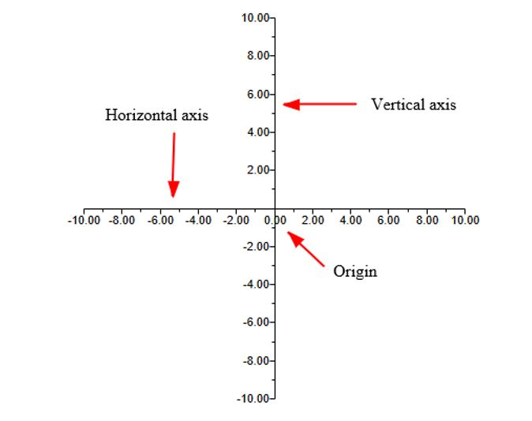
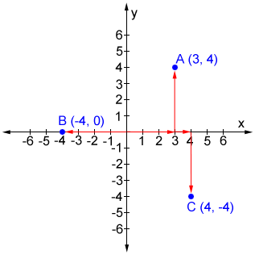
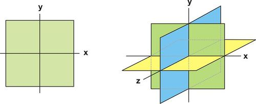

# Analytical Geometry

Analyticl geometry is the study of geometry using coordinate system. This topic is also known as coordinate geometry or Cartesian geometry.

---

# Number Line

Keywords -

- Horizontal axis (x-axis)
- Vertical axis (y-axis)
- Origin (the point of intersection of 2-axis)

---

# Coordinates

- A set of 2-values that shows the exact location of a point in the coordinate plane.
- Values are written inside parenthesis in x,y order (x,y).
- Examples
    - coordinates of a point A(3,4)
    - coordinates of a point B(-4,3)
    - coordinates of a point C(4,-4)

---

# Coordinate Plane

- A coordinate plane is a 2-d grid to represent shape and location of 2-d geometry. For 2-d geometry, it typically includes x-axis and y-axis.
- The key purpose is to represent and visualize the location of objects in space.
- For 3-d objects, 3-d grid is used which includes x-axis, y-axis, and z-axis.

---

# Coordinate Plane
