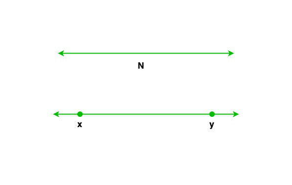

<h1 style="color: red;">Analytical Geometry</h1>

Analyticl geometry is the study of geometry using coordinate system. This topic is also known as coordinate geometry or Cartesian geometry.

---

<h1 style="color: red;">Number Line</h1>

Keywords -

- Horizontal axis (x-axis)
- Vertical axis (y-axis)
- Origin (the point of intersection of 2-axis)

{.center .xsmall}   
 

---

<h1 style="color: red;">Coordinates</h1>

- A set of 2-values that shows the exact location of a point in the coordinate plane.
- Values are written inside parenthesis in x,y order (x,y).
- Examples
    - coordinates of a point A(3,4)
    - coordinates of a point B(-4,3)
    - coordinates of a point C(4,-4)

---

<h1 style="color: red;">Coordinate Plane</h1>

- A coordinate plane is a 2-d grid to represent shape and location of 2-d geometry. For 2-d geometry, it typically includes x-axis and y-axis.
- The key purpose is to represent and visualize the location of objects in space.
- For 3-d objects, 3-d grid is used which includes x-axis, y-axis, and z-axis.

---

<h1 style="color: red;">Quadrants</h1>

- The intersection of x-axis and y-axis in the coordinate plane divides plane into 4 equal parts.  
- These parts are called quadrants because each part represents one-quarter of whole coordinate plane.
- Quadrants are labelled in roman characters - I, II, III, and IV.
- To label the quadrants correctly, move counter-clockwise starting from quadrant presenting (+x,+y) region, thus
    - Quadrant I = (+,+)
    - Quadrant II = (-,+)
    - Quadrant III = (-,-)
    - Quadrant IV = (+,-)

---

<h1 style="color: red;">Point</h1>

- A Point is represented by dot (.) on a coordinate plane.
- 0-dimensional object since it has no length, no width, no height and no depth. 
- It only has location which is presenting in coordinates form (x,y).
- Examples
    - Point A(3,4)
    - Point B(-4,3)
    - Point C(4,-4)

---

<h1 style="color: red;">Line</h1>

- 1-dimensional object that has length but no width or height.
- Line never ends therefore both ends of a line are marked with arrow marks.

---

<h1 style="color: red;">Line Segment</h1>

- Part of a line with 2 fixed end-points. In other words, you need 2 points to draw a line segment.
- Usually abbreviated as a line. 
- Image below shows a line-segment "xy" on a line "N".

---

<h1 style="color: red;">Distance between 2-points or Length of line segment</h1>

- Below is the formula to find 
    - Distance between any 2 points
    - Length of a line segment

$$ distance \ or \ length = \sqrt{(\Delta x)^2 + (\Delta y)^2}
= \sqrt{(x_2 - x_1)^2 + (y_2 - y_1)^2} $$

