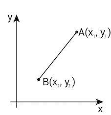
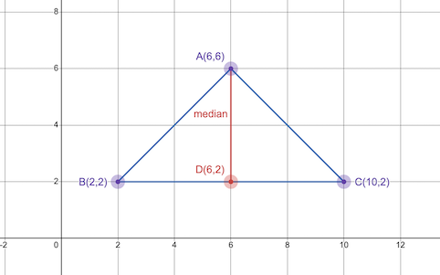

# **Analytical Geometry**

Analyticl geometry is the study of geometry using coordinate system. This topic is also known as coordinate geometry or Cartesian geometry.

---

# **Number Line**

Keywords -

- Horizontal axis (x-axis)
- Vertical axis (y-axis)
- Origin (the point of intersection of 2-axis)

{.center .xsmall}   
 

---

# **Coordinates**

- A set of 2-values that shows the exact location of a point in the coordinate plane.
- Values are written inside parenthesis in x,y order (x,y).
- Examples
    - coordinates of a point A(3,4)
    - coordinates of a point B(-4,3)
    - coordinates of a point C(4,-4)

---

# **Coordinate Plane**

- A coordinate plane is a 2-d grid to represent shape and location of 2-d geometry. For 2-d geometry, it typically includes x-axis and y-axis.
- The key purpose is to represent and visualize the location of objects in space.
- For 3-d objects, 3-d grid is used which includes x-axis, y-axis, and z-axis.

---

# **Quadrants**

- The intersection of x-axis and y-axis in the coordinate plane divides plane into 4 equal parts.  
- These parts are called quadrants because each part represents one-quarter of whole coordinate plane.
- Quadrants are labelled in roman characters - I, II, III, and IV.
- To label the quadrants correctly, move counter-clockwise starting from quadrant presenting (+x,+y) region, thus
    - Quadrant I = (+,+)
    - Quadrant II = (-,+)
    - Quadrant III = (-,-)
    - Quadrant IV = (+,-)

---

# **Point**

- A Point is represented by dot (.) on a coordinate plane.
- 0-dimensional object since it has no length, no width, no height and no depth. 
- It only has location which is presenting in coordinates form (x,y).
- Examples
    - Point A(3,4)
    - Point B(-4,3)
    - Point C(4,-4)

---

# **Line**

- 1-dimensional object that has length but no width or height.
- Line never ends therefore both ends of a line are marked with arrow marks.

---

# **Line Segment**

- Part of a line with 2 fixed endpoints. In other words, you need 2 points to draw a line segment.
- Usually abbreviated as a line. 
- Image below shows a line-segment "xy" on a line "N".

---

# **Distance between 2-points or Length of line segment**

- Below is the formula to find 
    - Distance between any 2 points
    - Length of a line segment

$$ distance \ or \ length = \sqrt{(\Delta x)^2 + (\Delta y)^2}
= \sqrt{(x_2 - x_1)^2 + (y_2 - y_1)^2} $$

---

## **Online Distance Calculator**

- Try this [online distance calculator](https://www.calculator.net/distance-calculator.html){:target"_blank"}

---

# **Slope of a line**

- Slope is the measure of steepness.  
- Mathematically, slope is calculated as **rise over run**

- Slope is denoted by "m".
- Slope of a line segment is denoted by $m_{AB}$ where A and B are endpoints of a line segment. 
- Formula

$$ m = \frac{rise}{run} = \frac{\Delta x}{\Delta y} = \frac{y_2 - y_1}{x_2 - x_1} $$

---

## **Online Slope Calculator**

- Try this [online slope calculator](https://www.calculator.net/slope-calculator.html){:target"_blank"}

---

## **Slope Intercept Form (Equation of a line)**

Also known as Equation of a linear (straight) line

$$ y = m*x + b$$

m = slope of the line  
x and y = coordinates of a point on the line  
b = y-intercept of the line  
(Intercept means a point where line intersects y-axis)  

!!! Tip

    
    If you know the equation of line, you can plug some value of x in the equation to find corresponding value of y on that line.  
    Using this method, you can find as many points as you want on the given line.
    

---

## **Slope Intercept Form - Practical**

!!! Exercise

    Draw few lines using Slope Intercept Form in graphical calculator or [online geometric tool](https://www.desmos.com/geometry)
    

!!! Exercise

    Plug in few values of x and find corresponding values of y and draw a table.  
    once you have a table prepared, draw these points on a coordinate plane to check if you are getting a straight line.
    
For example - for equation  
$$ y=2*x+4 $$

|x|y|
|---|---|
|1|6|
|2|8|
|3|10|

---

# **Median and Centroid of a Triangle**

- Median is a line that joins vertex of a triangle to the midpoint of opposite side.  
- There are 3 medians in a triangle each joining one vertex of the triangle to midpoint of opposite side.  
- Centroid is the point of intersection of medians of triangle.  

In the figure above -

- A1, A2, and A3 are 3-vertices of a triangle.  
- M1, M2, and M3 are 3-midpoints of sides of a triangle.  
- A1M1, A2M2, and A3M3 are 3-medians of a triangle.  
- G is the point of intersection of 3 medians of a triangle.  

---

## **Find Length of a Median**

2-step process 

1. Select a vertex to draw median and find the coordinates of midpoint of the side opposite to that vertex using a "Midpoint" formula.

    
    $$ midpoint(x,y) = \frac{x_1 + x_2}{2}, \frac{y_1 + y_2}{2}$$
    

    Here, x1, y1, x2, and y2 are the coordinates of endpoints of the side opposite to the selected vertex. 

2. Find the length of median using "Length of line" formula.

    
    $$ distance \ or \ length = \sqrt{(\Delta x)^2 + (\Delta y)^2}
    = \sqrt{(x_2 - x_1)^2 + (y_2 - y_1)^2} $$
    

    Here, x1, y1, x2, and y2 are the coordinates of midpoint and the vertex selected.

---

## **Find Slope of a Median**

2-step process

1. Select a vertex to draw median and find the coordinates of midpoint of the side opposite to that vertex using a "Midpoint" formula.

    
    $$ midpoint(x,y) = \frac{x_1 + x_2}{2}, \frac{y_1 + y_2}{2}$$
    
    
    Here, x1, y1, x2, and y2 are the coordinates of endpoints of the side opposite to the selected vertex. 

2. Find the slope of median using "Slope of line" formula.

    
    $$ m = \frac{rise}{run} = \frac{\Delta x}{\Delta y} = \frac{y_2 - y_1}{x_2 - x_1} $$
    
    
    Here, x1, y1, x2, and y2 are the coordinates of endpoints of the side opposite to the selected vertex. 

---

## **Find Equation of a Median**

3-step process

1. Find the slope (m) of the median. 
2. Substitute values of x, y and m in Slope Intercept Form to find b.

    
    $$ y= m*x + b $$
    
    Here x, and y are the coordinates of endpoints of the side opposite to the selected vertex. 

3. Substitute values of m and b in the Slope Intercept Form to write a new equation of the median.

!!! Example

    If the value of m is 2 and the value of b is 4, then your equation of median is y = 2x + 4.

---

## **Draw a Median of a Triangle**

- Simply find the midpoint of the side opposite to the vertex from where median is to be drawn and then draw a line joining vertex to the midpoint.

---

## **Find Centroid of a Triangle**

4-step process

1. Pick any 2 medians of the triangle
2. Find the equation of medians for both selected medians.
3. Put the equation of 1st median equals to the equation of 2nd median to find the value of x.
4. Substitute value of x in any one of the 2 equations of medians to find the value of y.

These values of x and y are the coordinates of the point of intersection of medians (Centroid) of the triangle.

---

# **Perpendicular Bisector and Circumcenter of a Triangle**

- A perpendicular bisector is a line that passes through the midpoint of a side of a triangle and is perpendicular to that side. 
- There are 3 perpendicular bisectors in a triangle.
- Circumcenter is the point of intersection of perpendicular bisectors of the triangle.

---

## **Find Length of a Perpendicular Bisector**

2-step process 

1. Select a vertex to draw perpendicular bisector and find the coordinates of midpoint of the side opposite to that vertex using a "Midpoint" formula.

    
    $$ midpoint(x,y) = \frac{x_1 + x_2}{2}, \frac{y_1 + y_2}{2}$$
    

    Here, x1, y1, x2, and y2 are the coordinates of endpoints of the side opposite to the selected vertex. 

2. Find the length of perpendicular bisector using "Length of line" formula.

    
    $$ distance \ or \ length = \sqrt{(\Delta x)^2 + (\Delta y)^2}
    = \sqrt{(x_2 - x_1)^2 + (y_2 - y_1)^2} $$
    

    Here, x1, y1, x2, and y2 are the coordinates of midpoint and the vertex selected.

---

## **Find Slope of a Perpendicular Bisector**

2-step process

1. Select a vertex to draw perpendicular bisector and Find the slope of line opposite to the selected vertex. 

    
    $$ m = \frac{rise}{run} = \frac{\Delta x}{\Delta y} = \frac{y_2 - y_1}{x_2 - x_1} $$
    

    Here, x1, y1, x2, and y2 are the coordinates of endpoints of the side opposite to the selected vertex. 

2. To find the slope of perpendicular bisector  between selected vertex and opposite side, find negative reciprocal of the slope (m) calculated in above step.

---

## **Find Equation of a Perpendicular Bisector**

3-step process

1. Find the slope (m) of the perpendicular bisector. 
2. Substitute values of x, y and m in Slope Intercept Form to find b.

    
    $$ y= m*x + b $$
    
    Here x, and y are the coordinates of endpoints of the side opposite to the selected vertex. 

3. Substitute values of m and b in the Slope Intercept Form to write a new equation of the perpendicular bisector.

!!! Example

    If the value of m is 2 and the value of b is 4, then your equation of perpendicular bisector is y = 2x + 4.

---

## **Draw a Perpendicular Bisector of a  Triangle**

- Simply find the midpoint of the base side on which perpendicular bisector is to be drawn and then draw a line, on the midpoint, perpendicular to the base line.

---

## **Find Circumcenter of a Triangle**

4-step process

1. Pick any 2 perpendicular bisectors of the triangle
2. Find the equation of perpendicular bisector for both selected perpendicular bisectors.
3. Put the equation of 1st perpendicular bisector equals to the equation of 2nd perpendicular bisector to find the value of x.
4. Substitute value of x in any one of the 2 equations of perpendicular bisectors to find the value of y.

These values of x and y are the coordinates of the point of intersection of perpendicular bisectors (circumcenter) of the triangle.

---

# **Altitude and Orthocenter of a Triangle**

- Altitude is a perpendicular distance from the vertex of triangle to the opposite side of triangle. It is represented as a perpendicular line.  
- There are 3-altitudes of a triangle that intersect at a point.  
- Altitudes can be formed inside or outside of the triangle depending on the type of triangle.  
- Orthocenter is a point of intersection of altitudes of the triangle.

Example of orthocenter (o) located outside of a triangle.

In above figure - 

- A,B, and C are 3-vertices of a triangle. 
- AD, BE, and CF are 3-altitudes of a triangle.
- Orthocenter is the point of intersection of 3 altitudes(or perpendiculars) of a triangle.

---

## **Find Length of an Altitude**

3-step process

1. Find the lengths of all sides of triagnle using "Length of line" formula.
2. Indentify the type of triangle from the length of sides.
3. Select formula based on the triangle type and find length of altitude.

| Triangle Type | Formula |
|---|---|
|Scalene Triangle| $$ h = \frac{\sqrt{s * (s-a) * (s-b) * (s-c)}}{b}  $$ |
|Isosceles Triangle| $$ h  = \sqrt{a^2 - \frac{b^2}{4}} $$ |
|Equilateral Triangle| $$ h = \frac{a\sqrt{3}}{4} $$ |

- In above table - 
    - h = height of the altitude  
    - a, b, c = lengths of sides of triangle. 
    - s = semi-perimeter (half of the perimeter) of triangle.  
    - To find semi-perimeter, add all lengths of sides of triangle and divide it by 2. s = (a+b+c)/2

---

## **Find Slope of an Altitude**

2-step process

1. Select a vertex to draw altitude and Find the slope of line opposite to the selected vertex. 

    
    $$ m = \frac{rise}{run} = \frac{\Delta x}{\Delta y} = \frac{y_2 - y_1}{x_2 - x_1} $$
    

    Here, x1, y1, x2, and y2 are the coordinates of endpoints of the side opposite to the selected vertex. 

2. To find the slope of altitude  between selected vertex and opposite side, find negative reciprocal of the slope (m) calculated in above step.

    
---

## **Find Equation of an Altitude**

3-step process

1. Find the slope (m) of the altitude.
2. Substitute values of x, y and m in Slope Intercept Form to find b.

    
    $$ y= m*x + b $$
    
    Here x, and y are the coordinates of the selected vertex from where the altitude is to be found.

3. Substitute values of m and b in the Slope Intercept Form to write a new equation of the altitude.

!!! Example

    If the value of m is 2 and the value of b is 4, then your equation of median is y = 2x + 4.
---

## **Draw an Altitude (Perpendicular) of a  Triangle**

3-step process

1. Find the equation of the altitude using the vertex (from which the altitude is to be drawn) and opposite side of triangle. 
2. Substitute some values of x in the equation of altitude to find cooresponding value of y for the altitude. These x,y values are the coorindates of a point on this altitude.  
3. Mark this point on the coordinate plane and draw a line joining vertex to this point. If needed, extend this line to the other side of the triangle. 

---

## **Find Orthocenter of a Triangle**

4-step process

1. Pick any 2 altitude of the triangle
2. Find the equation of altitude for both selected altitudes.
3. Put the equation of 1st altitude equals to the equation of 2nd altitude to find the value of x.
4. Substitute value of x in any one of the 2 equations of altitudes to find the value of y.

These values of x and y are the coordinates of the point of intersection of altitudes (Orthocenter) of the triangle.

    
---

